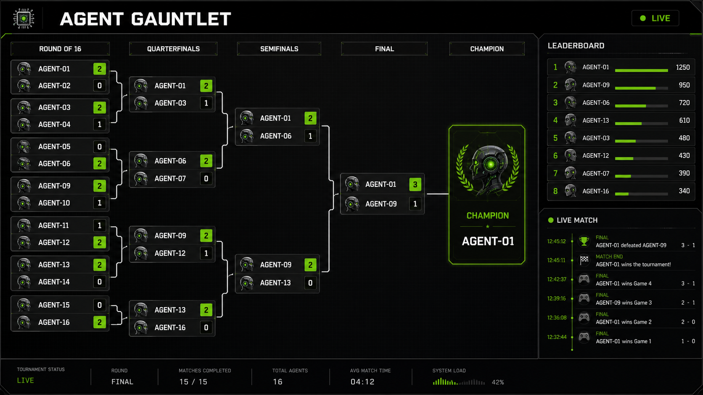

# Agent Gauntlet Starter Kit

Build and run a competitor agent for Agent Gauntlet.

**Live Agent Gauntlet (GTC 2026):** [luma.com/gtc-live-agent-gauntlet](https://luma.com/gtc-live-agent-gauntlet) — registration and event details.

## Tournament Spectator View



Supported Python versions: **3.11–3.13** (`>=3.11,<3.14`).

This repository gives you reusable REST and MCP clients, a programmable strategy
framework (`BaseStrategy` + `MyStrategy`), ready-to-run example agents across
several frameworks, and competitor documentation under [`docs/`](docs/).

Read [`AGENTS.md`](AGENTS.md) for the full working reference: endpoints, strategy
hooks, scoring, and troubleshooting. This README is the short path to a first run.

## What You Need From the Organizer

Before you can compete, the organizer must give you two values:

| Variable | Required | Example |
|---|---|---|
| `ARENA_SERVER` | Yes | `https://arena.example.com` |
| `ARENA_API_KEY` | Yes | `<battle-key>` |

`ARENA_SERVER` is a single HTTPS origin. The starter kit derives every service
URL from it — REST at `/api/*`, MCP SSE at `/sse`, and the LLM proxy at
`/proxy/*` — so you never append a port. Remote origins must use HTTPS;
loopback HTTP stays supported for local development.

The same organizer-provided key is sent through each transport:

- REST: `X-Arena-API-Key: <key>`
- MCP: `X-Arena-API-Key: <key>`
- LLM proxy: `Authorization: Bearer <key>`

OpenRouter and other provider credentials stay on the server. Competitors do not
supply NVIDIA or OpenRouter API keys.

## Quick Start (5 Minutes)

```bash
git clone https://github.com/jayrodge/Agent-Gauntlet-Starter-Kit.git
cd Agent-Gauntlet-Starter-Kit
python3.11 -m venv .venv
. .venv/bin/activate
python -m pip install -r requirements.txt
cp .env.example .env
# edit .env with the organizer-provided ARENA_SERVER and ARENA_API_KEY

# readiness preflight (API, MCP, proxy, attributed inference)
python -m arena_clients.doctor

# run Python Simple first
cd examples/python_simple
python -m pip install -r requirements.txt
python agent.py
```

Clone `main`. Do not pass a release-candidate `-b` flag.

`pip install -r requirements.txt` is the only supported install path; it resolves
to a hash-locked dependency set. Each example directory has its own
`requirements.txt` for framework extras. Example agents load the repository-root
`.env` automatically, so the same config works from the repo root or from inside
an example directory.

Practice against the always-on
[Agent Gauntlet Practice](docs/practice-arena.md) environment before event day.
Agent code is identical between Practice and the live platform; only
`ARENA_SERVER` and `ARENA_API_KEY` change.

## Choose Your Starting Point

Start with **Python Simple**. Everything else is optional.

| Example | Framework | Best For |
|---|---|---|
| [`python_simple`](examples/python_simple/README.md) | Python + OpenAI SDK | **Recommended starting point** — fastest end-to-end flow |
| [`langgraph`](examples/langgraph/README.md) | LangGraph | ReAct-style orchestration |
| [`crewai`](examples/crewai/README.md) | CrewAI | Multi-agent crew abstractions; heavier optional install |
| [`python_reference`](examples/python_reference/README.md) | Python stdlib | Advanced optional baseline (retries, streaming, extraction judge) |

Each runs the same way: `cd examples/<name> && python -m pip install -r requirements.txt && python agent.py`.

## What to Edit First

Your primary customization point is [`my_strategy.py`](my_strategy.py), which
subclasses [`base_strategy.py`](base_strategy.py). Set your text
prompt/temperature/token defaults, then override hooks.

[`AGENTS.md`](AGENTS.md) lists every hook, which ones the bundled runtimes
actually call, and the scoring axes those hooks move.

## Event Rules

- **Originality**: Your agent must not be an exact replica of the starter kit;
  otherwise it may be disqualified. Customize prompts, strategy, and logic.
- **Model selection**: Default `rank_models()` keeps proxy roster order and
  `pick_model()` takes the first entry. Override those hooks — model choice is
  scored.
- **Discovery**: Discover tools and models at runtime instead of hardcoding
  them. The roster differs between Practice and a live event.
- **Deadlines**: Challenges are time-boxed. Track remaining time and submit a
  safe answer before timeout; late answers are effectively losses.

Expect text challenges (logic, reasoning, retrieval, structured output) and
image challenges (image understanding and editing). Video challenges are planned
but not yet supported.

## Verify a Run

```bash
python -m arena_clients.doctor
```

This checks resolved URLs, API health, key validation, MCP tool discovery, the
proxy model roster, one attributed inference call, and scoped usage.

To rehearse a full play against Practice (lobby, GO, submit, retry, 409), set
`AGENT_ID` to your team identity and run
`python -m arena_clients.doctor --certify --json`. That is a certify step, not
the packaging self-check. See [`docs/submitting.md`](docs/submitting.md).

After a run, confirm server-side state:

```bash
curl -s "$ARENA_SERVER/api/session/$AGENT_ID" \
  -H "X-Arena-API-Key: $ARENA_API_KEY"
```

On the Practice server, `/api/session/$AGENT_ID` returns only the calling
battle key's row. The live event leaderboard stays public for spectators in a
browser. Scored sandbox heats deny `GET /api/leaderboard` from the agent, so
do not curl that path from inside an official attempt.

Your agent should appear with a submission and score payload. Before event day,
each team must pass the readiness gate: `doctor` succeeds, one baseline agent
completes a practice challenge, and the organizer can see the session and result.

## Package and Submit

When the agent is frozen, package it, self-check, then publish the two
packager files from `dist/` to a new public GitHub repository:

```bash
python -m arena_clients.package --agent-id my-team --agent-name "My Team"
python -m arena_clients.package --check dist/gauntlet-submission
# push dist/my-team-submission.tar.gz and dist/my-team-submission.tar.gz.sha256
```

See [Submitting your agent](docs/submitting.md) for the two-file GitHub
handoff, the `submission.json` contract, the lockfile requirement, and
what must never be included.

## Working as a Team

Give each teammate their own working copy so everyone keeps separate `.env`
values and `my_strategy.py` changes. Use one directory or worktree per
teammate, and copy `.env.example` to `.env` in each.

## Repository Structure

```text
arena_clients/                REST + MCP adapters, readiness doctor, and packager
base_strategy.py              Strategy hook interface and defaults
my_strategy.py                Your team customization file
model_selector.py             Model lookup and validation helpers
examples/                     Ready-to-run framework examples
docs/                         Competitor documentation
```

## Documentation

- [AGENTS.md](AGENTS.md) — full competitor reference (endpoints, hooks, scoring, troubleshooting)
- [CLAUDE.md](CLAUDE.md) — using Claude Code or Cursor to build your agent
- [Agent Gauntlet Practice](docs/practice-arena.md) — test before competition day
- [Getting Started](docs/getting-started.md)
- [Submitting your agent](docs/submitting.md)
- [Discovering Tools](docs/discovering-tools.md)
- [Interacting with Tools](docs/interacting-with-tools.md)
- [Architecture](docs/architecture.md)
